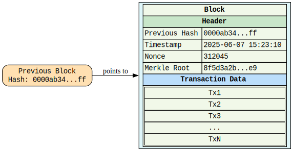

# 🧱 Mini Task 1: Build & Explain a Simple Blockchain

## ✅ Goal:
To understand blockchain fundamentals, block structure, and consensus mechanisms by simulating a mini blockchain and explaining how it works — both technically and conceptually.

---

## 📖 Theoretical Part

### 1. Blockchain Basics

A **blockchain** is a decentralized, distributed ledger technology where data is stored in blocks that are linked together using cryptography. Each block contains a set of transactions, a timestamp, and a reference (hash) to the previous block, ensuring data immutability. Blockchain operates on a peer-to-peer network, removing the need for a central authority. It enables trust and transparency among participants and is resistant to tampering and fraud due to its cryptographic structure and consensus mechanisms.

#### 🔗 Real-life Use Cases:
1. **Supply Chain Management**: Track goods from origin to consumer with transparency, reducing fraud and ensuring quality.
2. **Digital Identity**: Store and verify identities securely, enabling self-sovereign identity systems that protect user privacy.

---

### 2. Block Anatomy

#### 📦 Diagram of a Block:

#### 🧪 Merkle Root and Data Integrity:

The **Merkle root** is the root hash of a binary Merkle tree, which is formed by recursively hashing pairs of transaction hashes. It provides a compact way to verify if a transaction exists in a block without downloading the entire data.

**Example**:  
If you have 4 transactions `Tx1`, `Tx2`, `Tx3`, and `Tx4`, they are hashed and paired:
- `H1 = hash(Tx1)`, `H2 = hash(Tx2)`, then `H12 = hash(H1 + H2)`
- `H3 = hash(Tx3)`, `H4 = hash(Tx4)`, then `H34 = hash(H3 + H4)`
- Finally, `Merkle Root = hash(H12 + H34)`

If `Tx1` is changed, the Merkle root also changes, making data tampering easily detectable.

---

### 3. Consensus Conceptualization

#### ⚙️ What is Proof of Work (PoW)?

Proof of Work is a consensus mechanism where miners compete to solve a cryptographic puzzle by finding a nonce that results in a hash with a specific pattern (e.g., leading zeros). The first to solve it gets to add the next block and receive a reward. It requires substantial computational power and energy, making attacks costly and the network secure.

#### 🌱 What is Proof of Stake (PoS)?

Proof of Stake selects validators to create new blocks based on the number of coins they hold and are willing to "stake" as collateral. Unlike PoW, it doesn't involve solving complex puzzles, making it more energy-efficient. PoS encourages honest behavior, as malicious actions can lead to loss of stake.

#### 🗳️ What is Delegated Proof of Stake (DPoS)?

Delegated Proof of Stake involves token holders voting for a small group of trusted validators (delegates) who are responsible for validating blocks. Votes are weighted by the number of tokens held. This system increases efficiency and scalability while still maintaining decentralization through democratic selection of block producers.

